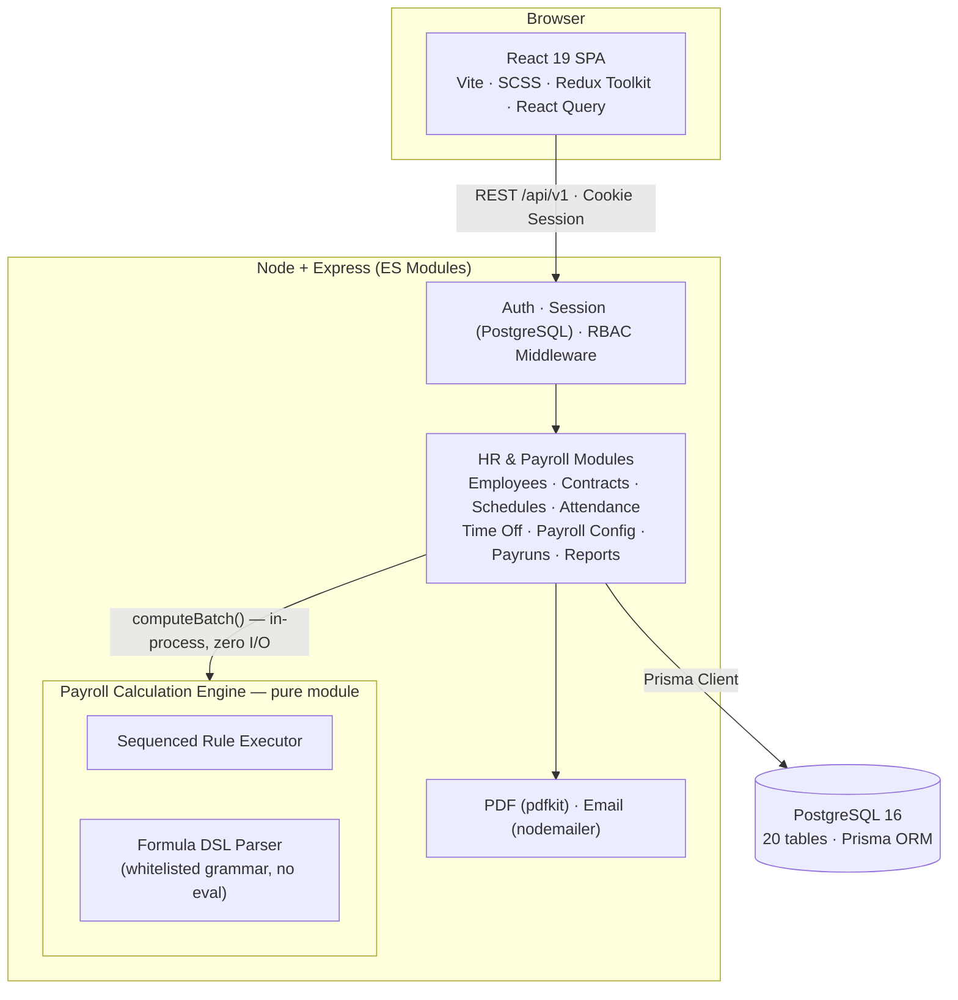
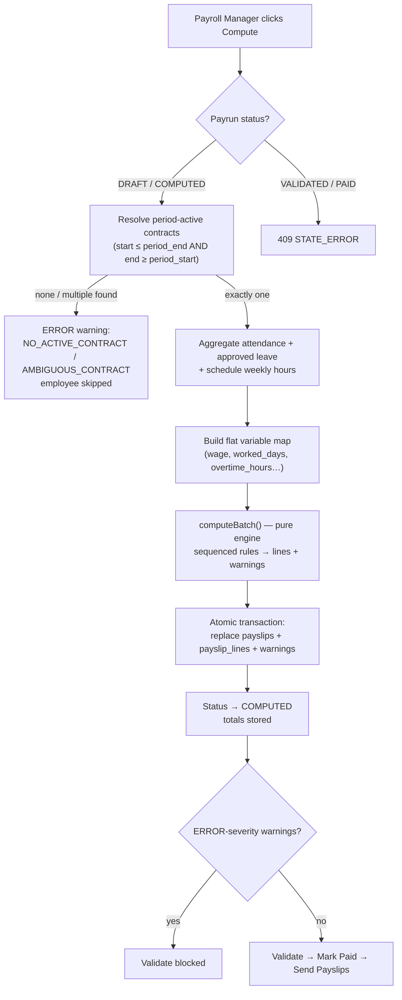
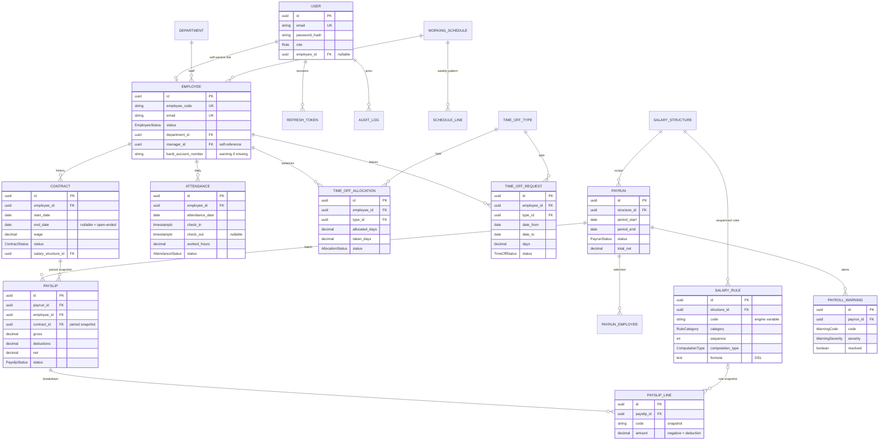
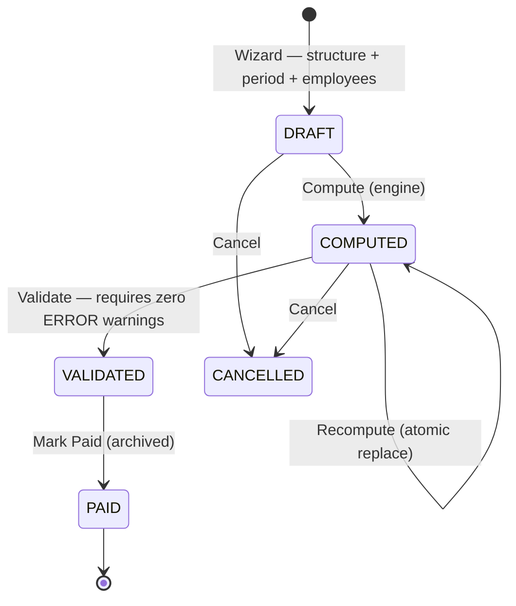
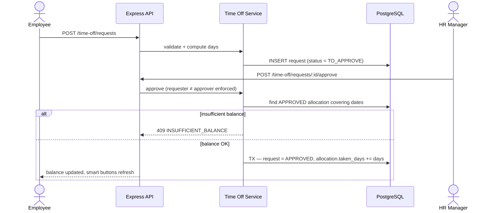

<div align="center">
  

# Pay365

**Modern HR & Payroll Operations Platform**

*From Employee Master Data to Validated Payslips — One Connected Flow*

<p>
  
  
  
  
  
  
  
  
</p>

</div>

---

## Table of Contents

- [Overview](#overview)
- [Key Features](#key-features)
- [Architecture](#architecture)
- [Payroll Calculation Engine](#payroll-calculation-engine)
- [Database Design](#database-design)
- [Business Workflows](#business-workflows)
- [Role-Based Access Control](#role-based-access-control)
- [Folder Structure](#folder-structure)
- [Getting Started](#getting-started)
- [Environment Variables](#environment-variables)
- [Business Rules](#business-rules)
- [Demo Scenarios](#demo-scenarios)
- [Design System](#design-system)
- [Testing](#testing)
- [Security](#security)
- [Documentation](#documentation)
- [Future Improvements](#future-improvements)
- [License](#license)

---

## Overview

**The Problem:** Basic HR tools store employees, attendance, leave, and salary as disconnected records. Real HR and payroll teams need these records to work together: payroll must use the contract valid for the pay period, worked hours must come from an assigned schedule, leave balances depend on allocations and approvals, and all of it must transform into accurate, explainable payslips.

**The Solution:** **Pay365** is an integrated HR & Payroll platform that connects the full employee-to-payslip lifecycle into one operational flow. The **Employee** is the hub; **Contracts** and **Working Schedules** provide payroll context; **Attendance** and **Time Off** capture day-to-day activity; **Salary Structures and Rules** drive salary computation; **Payruns** turn eligible employees into validated payslips that can be printed as PDF and emailed in bulk — all surfaced through a **live operations dashboard**.

> **Design principle:** salary rules actively drive payslip generation — the configuration screens are fully functional, not static mockups. Every metric on the dashboard is computed live from real records.

---

## Key Features

| Area | Features |
| :--- | :--- |
| Employee Master | Kanban/List/Form views, department–manager–schedule–job context, smart buttons linking to related records. |
| Contract Management | Historical contracts with period-based resolution — payroll always uses the contract valid for the pay period; overlapping active contracts are rejected. |
| Working Schedules | Weekly patterns (day, start, end, break) with **auto-computed weekly hours**; assignable to employees and contracts. |
| Attendance | Check-in/out with computed worked hours, status inference (Present / Late / Missing Checkout), HR corrections with audit trail. |
| Time Off | Configurable leave types, allocation lifecycle with approval, request → approve → **automatic balance deduction**. |
| Salary Structures & Rules | Sequenced rules with **fixed, percentage, and formula** computation; categories for Basic, Allowances, Gross, Deductions, Net. |
| Payrun Wizard | Two-step creation: scope (structure + period) → explicit employee selection → batch processing screen. |
| Payslips | Rule-by-rule computation breakdown, warnings surfaced before finalization, printable PDF, bulk email delivery. |
| Payroll Warnings | Missing bank details, duplicate payslips, missing/ambiguous contracts — surfaced **before** validation. |
| Live Dashboard | KPI cards, salary cost by department, monthly net trends, attendance & leave overviews — zero static data. |
| RBAC | 5 roles (Employee → Admin) enforced on every endpoint and every UI route. |
| Audit Trail | Immutable logs for approvals, payroll finalization, role changes, and manual corrections. |

---

## Architecture

Pay365 is a **3-tier system** with a strictly separated, pure in-process calculation engine:



**Core invariants:**

1. React never talks to PostgreSQL and never calculates salary.
2. Node owns all persistence and all workflow state machines.
3. The engine owns payroll math only — **pure functions, no DB, no HTTP, no I/O**; same input → same output, always.
4. Modules communicate through service-layer functions, never by reaching into another module's data layer.

---

## Payroll Calculation Engine

The engine executes salary rules **in sequence**, where later rules can reference earlier rule codes as variables. It supports three computation types:

| Type | Example | Result |
| :--- | :--- | :--- |
| `FIXED` | Transport = `3000` | ₹3,000 |
| `PERCENTAGE` | HRA = `20%` of `BASIC` | ₹10,000 |
| `FORMULA` | TAX = `GROSS > 50000 ? 2000 : 0` | ₹2,000 |

Formulas run through a **handwritten tokenizer + recursive-descent parser** with a strict grammar whitelist (numbers, variables, arithmetic, comparisons, logical operators, ternary). Function calls, property access, assignments, and prototype access are rejected at parse time — **no `eval`, no `new Function`**.

**Spec example — wage ₹50,000:**

```text
BASIC      = wage                    →  50,000
HRA        = 20% of BASIC            →  10,000
TRANSPORT  = fixed                   →   3,000
GROSS      = BASIC + HRA + TRANSPORT →  63,000
PF         = 12% of BASIC            →  −6,000
TAX        = GROSS > 50000 ? 2000:0  →  −2,000
NET        = GROSS − PF − TAX        →  55,000
```

**Compute orchestration flow:**



---

## Database Design

20 tables with historical snapshots, parent-child payroll relationships, and warning tracking:



**Key integrity decisions:**

- `UNIQUE(payrun_id, employee_id)` — exactly one payslip per employee per run; recompute atomically replaces.
- Cross-payrun overlapping payslips raise a **non-blocking `DUPLICATE_PAYSLIP` warning** (surfaced, not hidden).
- Payslips snapshot contract, structure, period, and line data — payroll history survives any upstream change.
- DB-level guarantees (CHECK constraints + active-contract exclusion constraint) enforced via raw-SQL migrations — see `docs/Others/schema-review.md`.

---

## Business Workflows

### Payrun Lifecycle (state machine)



### Leave Approval (automatic balance deduction)



---

## Role-Based Access Control

| Resource | Employee | HR Manager | HR Payroll User | HR Payroll Manager | Admin |
| :--- | :---: | :---: | :---: | :---: | :---: |
| Users & roles | — | — | — | — | Full |
| Employees / Contracts / Schedules / Attendance | Own (read) | Full | Full | Full | Full |
| Time Off requests — approve/refuse | Own only | Yes | Yes | Yes | Yes |
| Salary structures & rules | — | — | Read | Full | Full |
| Payruns | — | — | CRU + compute | Full + all actions | Full |
| Payslips | Own (read) | — | CRU | Full | Full |
| Dashboard | — | HR widgets | Read | Read | Read |

Enforced by `requireAuth` + `requireRole` middleware on every route, plus row-level checks in services (employees see only their own data; nobody approves their own leave). The UI adapts to the role — the API remains the source of truth.

---

## Folder Structure

```text
pay365/
├── backend/
│   ├── prisma/                  # schema.prisma, migrations, seed.js
│   └── src/
│       ├── config/              # env config (validated at startup)
│       ├── engine/              # PAYROLL CALCULATION ENGINE (pure module)
│       │   ├── executor/        # sequenced rule executor
│       │   ├── formula/         # safe formula parser (no eval)
│       │   ├── validator/       # rule-set validation
│       │   └── types/           # zod compute schemas
│       ├── modules/
│       │   ├── auth/            # login, logout, me, session auth
│       │   ├── users/           # admin user management
│       │   ├── employees/       # employees, departments, jobs
│       │   ├── contracts/
│       │   ├── schedules/
│       │   ├── attendance/
│       │   ├── timeoff/         # types, allocations, requests
│       │   ├── payroll-config/  # structures, rules
│       │   ├── payroll-run/     # payruns, payslips, warnings
│       │   ├── reports/         # dashboard aggregates
│       │   └── notifications/   # PDF + email
│       ├── middleware/          # auth, rbac, validate, errors, request-id
│       ├── shared/              # errors, logger, pagination, serializers
│       └── server.js
├── frontend/
│   └── src/
│       ├── app/                 # router, providers, layout, guards
│       ├── components/ui/       # DataTable, Modal, KpiCard, Badge...
│       ├── store/               # Redux store (authSlice, uiSlice)
│       ├── styles/              # SCSS design system (_variables, _mixins)
│       ├── lib/                 # api client, format, query-client
│       └── features/            # per-module pages + components + api hooks
├── docs/
│   ├── Implementation plan/     # architecture & task specifications
│   └── Others/                  # problem spec, schema review, change report
├── docker-compose.yml           # postgres + api + web
└── README.md
```

---

## Getting Started

### Prerequisites

- Node.js ≥ 20 · Docker & Docker Compose (recommended) — or PostgreSQL 16 locally

### Option 1 — One command (Docker)

```bash
docker-compose up --build
```

Then seed the demo dataset:

```bash
cd backend && npx prisma db seed
```

### Option 2 — Manual setup

```bash
# 1. Clone
git clone <repo-url> && cd pay365

# 2. Backend
cd backend && npm install
cp .env.example .env            # configure (see table below)
npx prisma generate
npx prisma migrate dev --name init
npx prisma db seed              # demo data: 12 employees, rules, 2 historical payruns

# 3. Frontend
cd ../frontend && npm install
cp .env.example .env
npm run dev
```

| Service | URL |
| :--- | :--- |
| Web app | `http://localhost:5173` |
| API Base | `http://localhost:4000/api/v1` |
| API Docs (Swagger) | `http://localhost:4000/api-docs` |
| Health Check | `http://localhost:4000/api/health` |

**Demo logins** (seeded, password `Password@123`): `admin@pay365.dev` (Admin) · `hr.manager@pay365.dev` (HR Manager) · `payroll.manager@pay365.dev` (HR Payroll Manager) · `payroll.user@pay365.dev` (HR Payroll User) · `employee@pay365.dev` (Employee)

---

## Environment Variables

| Variable | Location | Description |
| :--- | :--- | :--- |
| `DATABASE_URL` | backend | PostgreSQL connection string |
| `SESSION_SECRET` | backend | Secret string for signing session cookies (min 32 chars) |
| `SESSION_MAX_AGE_DAYS` | backend | Session lifetime in days (default `7`) |
| `PORT` | backend | API port (default `4000`) |
| `WEB_ORIGIN` | backend | CORS allow-list for the SPA (default `http://localhost:5173`) |
| `SMTP_HOST` / `SMTP_PORT` / `SMTP_USER` / `SMTP_PASS` / `SMTP_FROM` | backend | Payslip email (Ethereal catch-all in dev) |
| `VITE_API_URL` | frontend | Backend API base URL (`http://localhost:4000/api/v1`) |

> All config is validated at startup — the API refuses to boot with missing required variables. `.env` files are git-ignored; `.env.example` files document every variable.

---

## Business Rules

- [x] **Period-based contract selection** — payslips use the ACTIVE contract overlapping the payrun period; zero or multiple matches raise ERROR warnings (never a silent pick).
- [x] **No concurrent active contracts** — enforced by a DB exclusion constraint + transactional service check.
- [x] **Weekly hours are computed** from schedule lines — `Σ(end − start − break)` — never entered manually.
- [x] **Approved leave consumes allocation** — atomic transaction; insufficient balance blocks approval with `409 INSUFFICIENT_BALANCE`.
- [x] **Rules execute in sequence** — later rules reference earlier codes; `validateRules()` rejects invalid configs before they can ever run.
- [x] **Payrun state machine** — no payslip mutation after VALIDATED; PAID is terminal and archived.
- [x] **Duplicate payslips surfaced as warnings** — visible before finalization, never silently blocked.
- [x] **Missing bank details warned** before finalization.
- [x] **Self-approval blocked** — nobody approves their own leave request.
- [x] **Dashboard is live** — every metric is a query over real records, filtered by period / department / employee type.

---

## Demo Scenarios

**Scenario A — Employee to Payslip (~2.5 min):**
Login as HR Manager → Employees (Kanban) → open employee (smart buttons) → Payroll → New Payrun wizard (structure + period → select employees) → Compute → review warnings → Validate → Mark Paid → open payslip (rule-by-rule breakdown) → Print PDF → Send Payslips.

**Scenario B — Leave Allocation to Request (~2 min):**
Create Time Off Type → create & approve Allocation → submit Time Off Request → approve → balance auto-deducts → employee smart buttons + dashboard reflect the change.

---

## Design System

Clean, high-contrast SaaS aesthetic — pure white surfaces with an **Electric Royal Blue** accent (full spec in `docs/Implementation plan/DESIGN.md`):

| Token | Hex | Usage |
| :--- | :--- | :--- |
| Primary | `#2357FE` | CTAs, active states, links, logo |
| Primary hover | `#1A46D8` | Button hover |
| Subtle tint | `#EEF3FF` | Pill badges, selected rows, active tabs |
| Heading text | `#0F172A` | Titles, bold labels |
| Body text | `#475569` | Paragraphs, helper text |
| Border | `#E2E8F0` | Cards, inputs, dividers |
| Success / Warning / Danger | `#10B981` / `#F59E0B` / `#EF4444` | Status badges & payroll warnings |

Typography: **Bricolage Grotesque** (headings 400–800, body 200–800). Components: gradient primary buttons with ambient glow, glassmorphic floating navbar, 16–20px radius cards. All tokens live in `frontend/src/styles/_variables.scss`.

---

## Testing

| Layer | Tool | Coverage |
| :--- | :--- | :--- |
| Engine (pure units) | Vitest | Rule types, sequencing, conditions, rounding, formula-safety rejections, idempotency |
| API units | Vitest | Services, validators, helpers |
| API integration | Supertest | Every P0 endpoint: happy path + error path + 403 per role |

**Key business scenarios under test:** period-contract selection (two contracts, correct one wins) · leave deduction math (10 → request 3 → remaining 7) · the ₹50,000 spec example (exact line breakdown) · RBAC 403 enforcement · duplicate-payslip semantics (recompute = clean replace; overlapping run = warning).

---

## Security

- **Auth:** Stateful session authentication (`express-session` + PostgreSQL store) with `httpOnly`, `Secure` (in prod), `SameSite=lax` cookies, and session fixation protection on login (`req.session.regenerate()`).
- **Passwords:** bcrypt (cost 12); never logged, never returned.
- **Validation:** zod on every endpoint body/query/param; unknown fields stripped.
- **Injection safety:** Prisma parameterized queries only; formula DSL rejects calls, property access, and prototype access at parse time.
- **Rate limiting:** login (5 fails / 15 min) + global limits.
- **Audit:** every approval, payroll transition, role change, and manual correction is logged with actor, IP, and payload diff.
- **PII hygiene:** bank account numbers masked to last 4 in UI and logs.

---

## Documentation

| Document | Contents |
| :--- | :--- |
| **Interactive API Docs (Swagger)** | [`/api-docs`](http://localhost:4000/api-docs) — Interactive OpenAPI 3.0 specification & endpoint explorer |
| [`docs/Others/PeoplePay365 HR & Payroll.md`](docs/Others/PeoplePay365%20HR%20&%20Payroll.md) | Original problem specification |
| [`docs/Implementation plan/00-MASTER-PLAN.md`](docs/Implementation%20plan/00-MASTER-PLAN.md) | Stack, phases, task board |
| [`docs/Implementation plan/02-SYSTEM-ARCHITECTURE.md`](docs/Implementation%20plan/02-SYSTEM-ARCHITECTURE.md) | Architecture decisions & data flows |
| [`docs/Implementation plan/03-DATABASE-DESIGN.md`](docs/Implementation%20plan/03-DATABASE-DESIGN.md) | Full schema specification |
| [`docs/Implementation plan/04-API-CONTRACTS.md`](docs/Implementation%20plan/04-API-CONTRACTS.md) | REST endpoint contracts |
| [`docs/Implementation plan/05-PAYROLL-ENGINE-CONTRACT.md`](docs/Implementation%20plan/05-PAYROLL-ENGINE-CONTRACT.md) | Engine module contract & formula DSL |
| [`docs/Implementation plan/06-FRONTEND-ARCHITECTURE.md`](docs/Implementation%20plan/06-FRONTEND-ARCHITECTURE.md) | Routes, state, component taxonomy |
| [`docs/Implementation plan/07-SECURITY-RBAC.md`](docs/Implementation%20plan/07-SECURITY-RBAC.md) | Auth strategy & permission matrix |
| [`docs/Implementation plan/08-ROADMAP-AND-TASKS.md`](docs/Implementation%20plan/08-ROADMAP-AND-TASKS.md) | Task specifications & QA scenarios |
| [`docs/Implementation plan/DESIGN.md`](docs/Implementation%20plan/DESIGN.md) | Design system & color palette |
| [`docs/Others/schema-review.md`](docs/Others/schema-review.md) | Schema review & fix recommendations |

---

## Tech Stack

| Category | Technologies |
| :--- | :--- |
| **Frontend** | React 19, Vite, JavaScript (JSX), SCSS design system |
| **State & Forms** | Redux Toolkit, TanStack React Query, React Hook Form, Zod |
| **Data Visualization** | Recharts |
| **Backend** | Node.js, Express 5 (ES Modules) |
| **API Documentation** | Swagger / OpenAPI 3.0 (`swagger-ui-express`) |
| **Payroll Engine** | In-process pure module — sequenced executor, handwritten formula parser, decimal.js |
| **Database & ORM** | PostgreSQL 16, Prisma |
| **Auth** | Stateful session auth (`express-session` + `connect-pg-simple`), bcryptjs |
| **Documents & Email** | pdfkit, nodemailer |
| **Testing** | Vitest, Supertest |
| **Infrastructure** | Docker Compose |

---

## Future Improvements

- [ ] Background job queue for large payruns (compute beyond request timeout).
- [ ] Redis-backed caching layer for dashboard aggregates.
- [ ] Employee self-service mobile app (payslip viewing, leave requests).
- [ ] Configurable tax tables & statutory report exports (Form 16, PF/ESI filings).
- [ ] Real-time notifications (WebSocket) for approvals and payroll events.
- [ ] Multi-company / multi-tenant support.
- [ ] CSV/Excel import for attendance and employee bulk onboarding.

---

## Contributors

Built with care during a hackathon.

Contributions, issues, and feature requests are welcome!

---

## License

This project is [MIT](./LICENSE) licensed.
